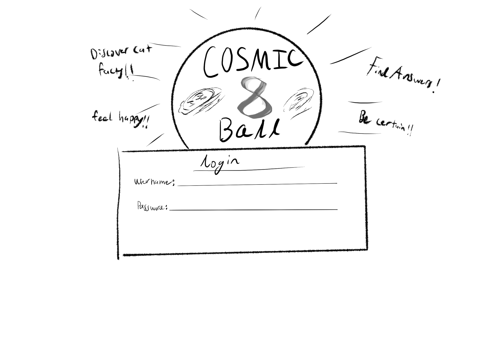
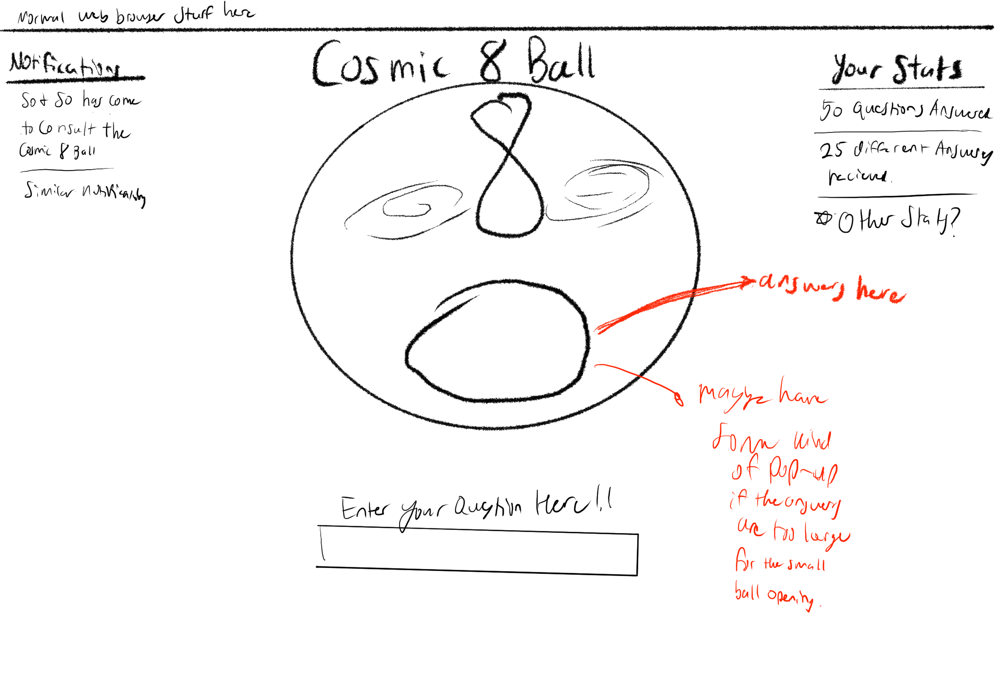

# Cosmic 8-Ball

[My Notes](notes.md)

This application is a simple magic 8 ball responder, wherein a user types in their question and is given a simple answer. It incorporates all the usual 8-ball responses, but also throws in some random ones that may surprise you. It requires a login, so that it can store the number of times you received a certain response, and lets you know whether someone else has entered the 8-ball website.

<!-- > [!NOTE]
>  This is a template for your startup application. You must modify this `README.md` file for each phase of your development. You only need to fill in the section for each deliverable when that deliverable is submitted in Canvas. Without completing the section for a deliverable, the TA will not know what to look for when grading your submission. Feel free to add additional information to each deliverable description, but make sure you at least have the list of rubric items and a description of what you did for each item.

> [!NOTE]
>  If you are not familiar with Markdown then you should review the [documentation](https://docs.github.com/en/get-started/writing-on-github/getting-started-with-writing-and-formatting-on-github/basic-writing-and-formatting-syntax) before continuing. -->

## 🚀 Specification Deliverable
<!-- 
> [!NOTE]
>  Fill in this sections as the submission artifact for this deliverable. You can refer to this [example](https://github.com/webprogramming260/startup-example/blob/main/README.md) for inspiration. -->

For this deliverable I did the following:
I checked the box `[x]` and added a description for things I completed.

- [x] Proper use of Markdown
- [x] A concise and compelling elevator pitch
- [x] Description of key features
- [x] Description of how you will use each technology
- [x] One or more rough sketches of your application. Images must be embedded in this file using Markdown image references.

### Elevator pitch

Do you feel paralyzed by choice in this increasingly consumer focused world? Do you need an excuse to not work on homework? Do you need to know whether a certain someone likes you? Well, the magic 8 ball waits to answer these pressing questions and bring you completely relevant and truthful advice.

But wait there's more, this 8 ball isn't just your everyday, run-of-the-mill magic 8 ball, it is more accurately named the COSMIC 8-Ball, on account of it's cosmically large set of answers (including weather reports and random cat facts).

### Design




<!-- 
```mermaid
sequenceDiagram
    actor->> You
    actor->> Website
    User->>Website: Open homepage
    Website->>User: Display homepage
    User->>Website: Login with credentials
    Website->>User: Display user dashboard
``` -->

### Key features

- login and logout capabilities!
- Additional responses than the usual ones!
- Answers your deepest questions! (provided you don't care so much about the quality)
- Lets you know if someone else is logged on as well
- Displays a list of all the answers you've received upon request

### Technologies

I am going to use the required technologies in the following ways.

- **HTML** - Pages for login and displaying the 8-ball.
- **CSS** - look and feel of the website, color scheme and fomatting for desktop and smartphone viewing.
- **React** - Interaction with buttons and handling changes between web pages.
- **Service** - Retrieves information about the weather, random cat facts and random dog facts.
- **DB/Login** - stores information about the user's questions and answers. Also securely stores user information and verifies login information.
- **WebSocket** - Displays a notification on the side bar whenever another user has joined the COSMIC 8-Ball. Though I might allow players to provide answers to other players if that would be possible?

## 🚀 AWS deliverable

For this deliverable I did the following. I checked the box `[x]` and added a description for things I completed.

- [x] **Server deployed and accessible with custom domain name** - [My server link](https://cosmic-8-ball.click/).

## 🚀 HTML deliverable

For this deliverable I did the following. I checked the box `[x]` and added a description for things I completed.

- [x] **HTML pages** I added 4 html pages to my website. the obvious index.html, about.html, yourStats.html, questionAndAnswer.html
- [x] **Proper HTML element usage** - I included all the necessary elements in my html pages, including heads and body sections, headers, footers, and main sections. I included forms where applicable, and images and so on.
- [x] **Links** - I included links between each of the pages of my website, and I included external links in my about.html document.
- [x] **Text** - I included text where possible and gave some brief descriptions which I will finish writing by later deliverables.
- [x] **3rd party API placeholder** - I included a placeholder description on the questionAndAnswer.html page that will eventually be populated by random facts and other things.
- [x] **Images** - I included a basic image on every page, along with some placeholder text because I need to finish creating some of the art that I will be uploading.
- [x] **Login placeholder** - I have completed a login portion on the main page of the website.
- [x] **DB data placeholder** - I have included a table on the yourStats.html page that includes a placeholder table that will be populated by the database data i include.
- [x] **WebSocket placeholder** - I have included a placeholder text describing how I will incorporate websocket through displaying the usernames of those people who have just received answers from the 8-ball as the current user is thinking of a question to ask.

## 🚀 CSS deliverable

For this deliverable I did the following. I checked the box `[x]` and added a description for things I completed.

- [x] **Header, footer, and main content body** - Each of these sections has received attention to the coloration and placement. They are also responsive to sizing.
- [x] **Navigation elements** - The navigation elements have gotten an overhaul, they're now much more visibly pleasing.
- [x] **Responsive to window resizing** - Using flex and the bootstrap CSS framework, my website is very responsive to window resizing.
- [x] **Application elements** -the application elements that I knew how I wanted to style, I did so. However, there are some elements that I could not decide on how to style, and those have been left as simple paragraphs for now.
- [x] **Application text content** I used the bootstrap framework, as well as a little bit of CSS to make sure that the text looked like it fit the rest of the deliverable.
- [x] **Application images** - I drew one main image in procreate and included that throughout the website, though I would like to do a few more smaller scale images.

## 🚀 React part 1: Routing deliverable

For this deliverable I did the following. I checked the box `[x]` and added a description for things I completed.

- [x] **Bundled using Vite** - I installed Vite and bundled my web application.
- [x] **Components** - I create the proper references to the stubbed components as `.jsx` files, and then made sure they worked.
- [x] **Router** - The routing between login and other components does work, and it works quite well!

## 🚀 React part 2: Reactivity

For this deliverable I did the following. I checked the box `[x]` and added a description for things I completed.

- [ ] **All functionality implemented or mocked out** - I did not complete this part of the deliverable.
- [ ] **Hooks** - I did not complete this part of the deliverable.

## 🚀 Service deliverable

For this deliverable I did the following. I checked the box `[x]` and added a description for things I completed.

- [ ] **Node.js/Express HTTP service** - I did not complete this part of the deliverable.
- [ ] **Static middleware for frontend** - I did not complete this part of the deliverable.
- [ ] **Calls to third party endpoints** - I did not complete this part of the deliverable.
- [ ] **Backend service endpoints** - I did not complete this part of the deliverable.
- [ ] **Frontend calls service endpoints** - I did not complete this part of the deliverable.

## 🚀 DB/Login deliverable

For this deliverable I did the following. I checked the box `[x]` and added a description for things I completed.

- [ ] **User registration** - I did not complete this part of the deliverable.
- [ ] **User login and logout** - I did not complete this part of the deliverable.
- [ ] **Stores data in MongoDB** - I did not complete this part of the deliverable.
- [ ] **Stores credentials in MongoDB** - I did not complete this part of the deliverable.
- [ ] **Restricts functionality based on authentication** - I did not complete this part of the deliverable.

## 🚀 WebSocket deliverable

For this deliverable I did the following. I checked the box `[x]` and added a description for things I completed.

- [ ] **Backend listens for WebSocket connection** - I did not complete this part of the deliverable.
- [ ] **Frontend makes WebSocket connection** - I did not complete this part of the deliverable.
- [ ] **Data sent over WebSocket connection** - I did not complete this part of the deliverable.
- [ ] **WebSocket data displayed** - I did not complete this part of the deliverable.
- [ ] **Application is fully functional** - I did not complete this part of the deliverable.
