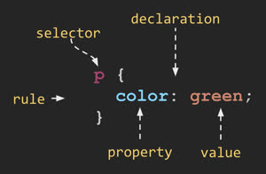

# CS 260 Notes

[My startup - Simon](https://simon.cs260.click)

## Helpful links

- [Course instruction](https://github.com/webprogramming260)
- [Canvas](https://byu.instructure.com)
- [MDN](https://developer.mozilla.org)

## AWS

I managed to create an AWS account, though I'm not sure what any of the vernacular means.
I learned about how to host a webserver, I learned how to ssh! That's quite exciting because that means I can ssh into other applications!! I wonder if I could do it like the guys in my capstone.

Also, this is a super important command! This allows me to ssh into my server and thus edit code there in later deliverables. 
`ssh -i ~/Documents/Chris_Documents/cpaulmechcs260webserver.pem ubuntu@44.199.41.73`
If I did it right, I should be using the free tier of aws, and if something crazy happens they might charge me a little, but it should not be a whole lot of charges.

Apparently we need to pay for a domain name!! How exciting 
NS means name server records.
SOA stands for start of authority records.
It is generally recommended to not edit these records, because they are essential for the proper functioning of AWS servers.

My website can be accessed through http://cosmic-8-ball.click Isn`t that exciting!!!

## Caddy
Caddy was made by a member of the Church of Jesus Christ of Latter Day Saints! Interesting. It seems like such a no brainer of a product to make
I wonder why it hadn`t been created before. Also the Caddy configuration files are really interesting to look at. 

I learned again how to edit files with VIm, you need to type `vi <filename>` then hit the insert key to make some changes, add or delete some stuff.
Then you need to tap escape to exit editing mode, then you type `:wq` to write to the file, then quit VIm in one command. It does make me feel like a hacker. 

Also, because of the changes I made to the Caddyfile, my little website is secure now!! using https://cosmic-8-ball.click 

## HTML

Codepen is a cool website that allows you to make cool website and save cool website. Not lose data. Mess around with ideas and stuff.
Every HTML element has attributes, two of the most common are id and class. Example: 
```html
<p id="hello" class="greeting">Hello world</p>
```

### Hyperlinks:
```html <a href="https://byu.edu">Go to the Y</a>``` An example of a hyperlink syntax.\

For common elements look https://github.com/webprogramming260/.github/blob/main/profile/html/introduction/introduction.md 
The HTML structure is important because that way search engine crawlers can search through your website looking for the correct information.

html Code for simple embedded pictures: 
```html
 </img>
```

the `form` element has been useful in the past, and is often still traditionally used to denote something that requires user input.
Finished up to the Checkbox deliverable checkpoint for my CS 260 homework.
Also interesting, the `canvas` HTML media element type, I wonder how to use that? It sounds interesting.
You can include audio like so: 
```html 
<audio controls src="testAudio.mp3"></audio>
```
additional attributes include `autoplay` and `loop`.

From the correct directory: I can run this command to connect to my webservice and rewrite some of the code. `./deployFiles.sh -k ~/Documents/Chris_Documents/cpaulmechcs260webserver.pem -h cosmic-8-ball.click -s simon`

I think that my plan will be to create the following pages.

- [x] home page which is the login page
- [x] Question and Answer page
- [x] History Page along with stats agrigation
- [x] About page

## CSS

CSS code defines rules, that are comprised of a `selector` that selects the elements to apply the rule to, and one or more `declarations` that represent the `property` to style with the given `property value`.


There are multiple ways to include CSS into your html, but the way we will probably use is to use the HTML `link` element to create a hyperlink reference to an external file containing the CSS rules. Such as this: ```<link rel="stylesheet" href="styles.css" />``` the link must appear in the `head` element of the document.
The pseudo selector seems particularly interesting, I wonder if this is how most websites do the hover lightening effect when they write websites.

Units Notes: `em` is defined as a "multiplier of the width of the letter m in the parent`s font" it seems like `em` is a well used unit. Is that because modern websites allow you to resize the text, and therefore you would want to make the formatting dependent on the size of the font?
There are 4 major families of fonts, serif, sans-serif, fixed, and symbol. 

Google offers free fonts that you can use without paying royalties. The easiest way to use Google fonts is to use a CSS import statement to reference the Google Font Service. This will automatcally generate the CSS for importing the font. 

Here is my worked out solution to the CSS Practice assignment: https://codepen.io/cpaul-mech/pen/qEWGZJK

The `float` css property moves an element to the right or the left of it`s container element and allows inline elements to wrap around it.

Use the `@media` selector allows me to grab the size and orientation of the screen that is viewing the display.
For instance, with the `@media (orientation: portrait) {aside{display: none;}}` this will make the `aside` element dissapear if the web page is viewed in portrait mode rather than normal mode.

The code `html {
  height: 100%;
}` was the command I was missing to make sure that the web-page fills the screen. Might come in handy later. 
Also I learned that when using `flex` elements, one needs to specify in each children's rule set the `display: flex;`, `flex-direction`, `justify-content`, and `align-items` choices.

Bootstrap: You need to add the correct link thing into the html head element. That allows you to code bootstrap elements into your websites.

## JavaScript
How to insert javascript into html?
1. **Script block**: Directly including it in the HTML within the content of a `<script>` element
1. **External code**: Using the `src` attribute of the script element to reference an external JavaScript file.
1. **Inline event attribute**: Putting JavaScript directly inline as part of an event attribute handler.

Use the web browser debugger in order to see what the variables are during execution. You can also choose to print variables and stuff to the console window so that you cna read it off. Also in the Chrome debugger.

make sure that when you run your code you're using `node.js` to run your code, like with the debugging tool through `F5` and not through the live server extension. 

To configure `npm`, you must do something like this: `npm init` after navigating to the correct directory.

Here is the step by step process:
1. Create your project directory
1. Initialize it for use with NPM by running `npm init -y`
1. Make sure `.gitignore` file contains `node_modules`
1. Install any desired packages with `npm install <package name here>`
1. Add `require('<package name here>')` to your application's JavaScript
1. Use the code the package provides in your JavaScript
1. Run your code with `node index.js`
## React Part 1: Routing

## React Part 2: Reactivity


